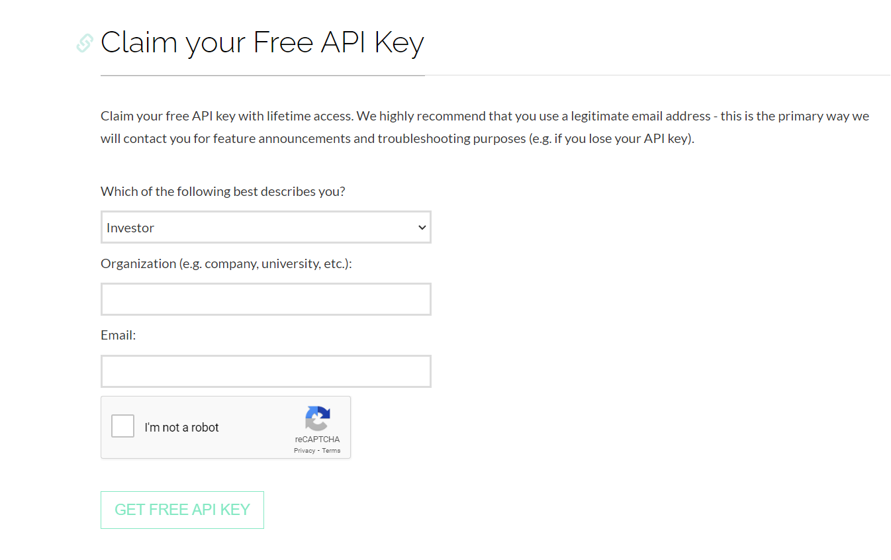
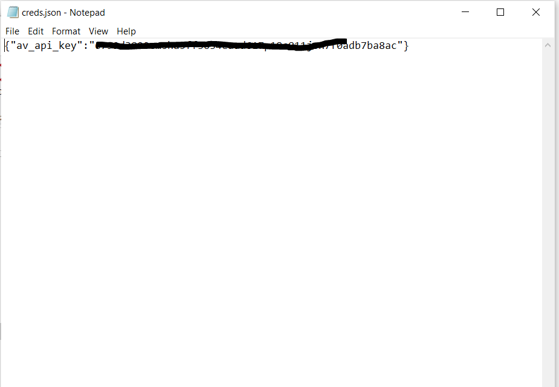
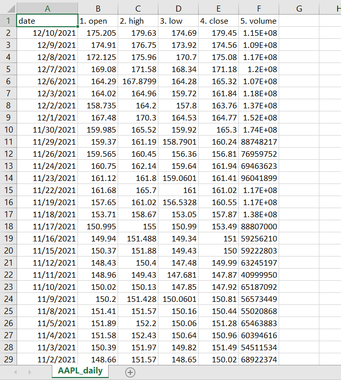
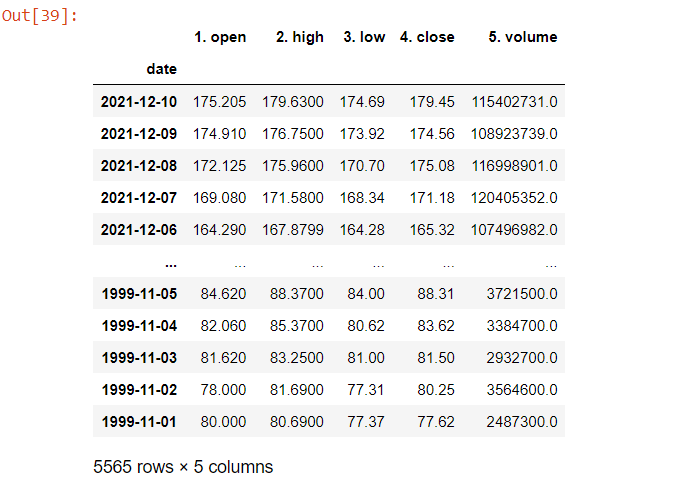
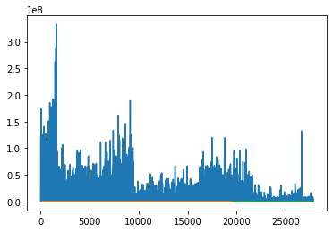
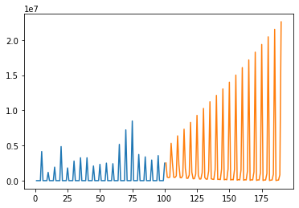

## Technologies 
Technologies used in the project
* Python
* numpy
* sklearn
* pandas
* alpha_vantage
* json
* tensorflow
* keras

## Setup

To run this project, go the website https://www.alphavantage.co/support/#api-key to register and claim a free API key.

After registering and downloading the key, save the key in a file called "creds.json" and save in the same directry.

Then change the api key in the "Course Project" file and run the code to obtain the stock data using the API key. The code creates a CSV file having all the data. 
The CSV file which is created can be viewed like below.

The dataset used in the project is viewed like below while running it on jupyter notebook.

The project uses nueral networks to build the datasets needed for the prediction of stocks using the dataset from the csv file.
The output data is analysed from the data set and is plotted as below

The Predicted value is in orange color with repect to the data obtained from the datasets which is in blue color.

